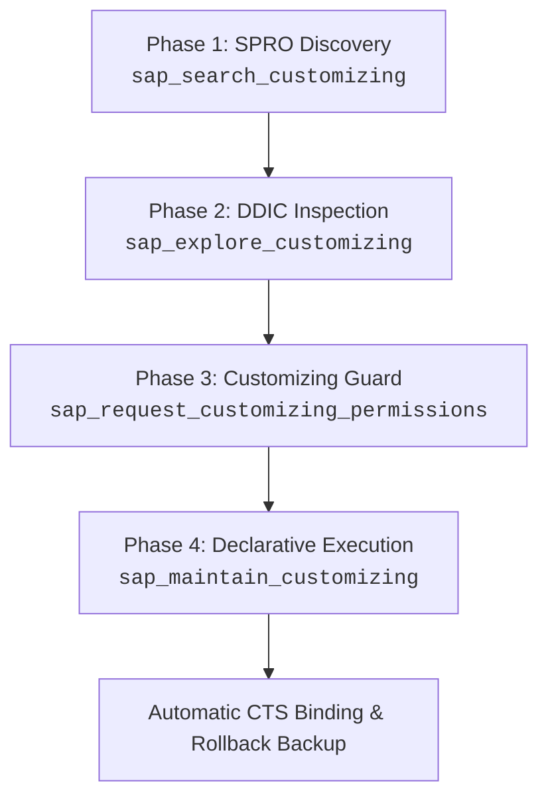

<!-- AUTO-GENERATED FILE - DO NOT EDIT MANUALLY. Source: agents-docs/skill-source/templates -->

# Customizing & SPRO Maintenance Guide (SM30 / SM34)

This manual defines the canonical 4-phase GitOps workflow for discovering, exploring, authorizing, and maintaining SAP Customizing tables, views, and view clusters.

---

## 🎯 The 4-Phase Customizing Lifecycle



---

### Phase 1: Customizing Discovery (`sap_search_customizing`)

Search the SAP SPRO Customizing hierarchy using natural language keywords or resolve the reverse SPRO path for known tables/views:

*   **Keyword Discovery**:
    ```json
    sap_search_customizing(
      system_alias: "TD1-300",
      query: "handling unit type",
      scope: "activities"
    )
    ```
*   **Reverse Path Resolution (Find SPRO node from Table/View)**:
    ```json
    sap_search_customizing(
      system_alias: "TD1-300",
      table_name: "/SCWM/T300_MD"
    )
    ```
*   **Child Node Browsing**:
    ```json
    sap_search_customizing(
      system_alias: "TD1-300",
      folder_id: "SIMG_CFG_EWM"
    )
    ```

---

### Phase 2: Explore Context & Fetch Records (`sap_explore_customizing`)

Retrieve complete DDIC table metadata, primary keys, check tables, domain fixed values, official IMG documentation, and existing sample records:

```json
sap_explore_customizing(
  system_alias: "TD1-300",
  customizing_target: "/SCWM/VC_METHOD",
  include_data: true,
  max_rows: 50
)
```

**What is returned**:
- `target_type`: `'VIEW'`, `'TABLE'`, or `'VCLS'` (View Cluster).
- `key_fields`: Primary key components and required lengths.
- `text_table`: Associated language-dependent text table (if applicable).
- `check_tables`: Foreign key relationships.
- `existing_data`: Current rows formatted as JSON objects.

---

### Phase 3: Request Governance Authorization (`sap_request_customizing_permissions`)

Customizing modifications require explicit prior authorization via the SAP GUI Guard. Submit the target customizing object and CTS Transport Request to the user's pending queue:

```json
sap_request_customizing_permissions(
  system_alias: "TD1-300",
  customizing_target: "/SCWM/VC_METHOD",
  transport_request: "TD1K900123",
  description: "Maintain Warehouse Monitor button methods"
)
```
- Instruct the user to approve the pending request in the **SAP GUI Guard** tab of the Web Dashboard.
- Once approved, subsequent maintenance calls automatically inherit the approved CTS Transport Request.

---

### Phase 4: Execute Declarative Maintenance (`sap_maintain_customizing`)

Maintain records declaratively using `entries` or an `input_file_path`. Under the hood, `sap_maintain_customizing` automatically dispatches to the SAP GUI for Java automation engine (`SM30` for tables/views and `SM34` for view clusters), performing automatic table positioning, screen adaptation, warning dialog dismissal, and CTS transport injection:

*   **Insert or Update Records (`action: "INSERT_UPDATE"`)**:
    ```json
    sap_maintain_customizing(
      system_alias: "TD1-300",
      customizing_target: "/SCWM/VC_METHOD",
      action: "INSERT_UPDATE",
      entries: [
        { "MTH_NAME": "ZSHOW_HU", "MTH_DESCR": "Show HU Details", "IS_ACTIVE": "X" }
      ]
    )
    ```

*   **Delete Records (`action: "DELETE"`)**:
    ```json
    sap_maintain_customizing(
      system_alias: "TD1-300",
      customizing_target: "/SCWM/VC_METHOD",
      action: "DELETE",
      entries: [
        { "MTH_NAME": "ZSHOW_HU" }
      ]
    )
    ```

---

## 🛡️ Safety Invariants & Rules

1. **Automatic CTS Transport Request Binding**:
   - The maintenance engine isolates all CTS Transport Request popups (`SAPLSTRD`).
   - Approved transport numbers from SAP GUI Guard are automatically injected. Agents must never attempt to script `SAPLSTRD` or pass `KO008-TRKORR` directly in fields.
2. **Adaptive 1-Step / 2-Step Views**:
   - In `SM30`, single-step views display overview tables, while two-step views display an overview table plus a detail screen. When a two-step view is empty, SM30 opens the detail screen directly. The reconciler automatically adapts and populates form fields without throwing "Choose a valid function" errors.
3. **Dirty Buffer Reset via `/n`**:
   - On validation errors, foreign key rejections, or unexpected modal popups, the engine immediately sends `/n` to discard dirty memory buffers and preserve database integrity.
4. **Rollback Backups**:
   - Every mutating run automatically captures the previous table state and persists a rollback snapshot to `./tmp/customizing_backups/`.
5. **Customer Namespaces**:
   - When introducing new entries or test keys, use standard customer namespaces (keys beginning with `Y*` or `Z*`) to prevent standard namespace lock warnings.
6. **Exotic Transactions & Non-SM30/SM34 Activities**:
   - Any customizing activity requiring non-standard, proprietary dynpro transactions (without standard SM30/SM34 table maintenance generators) must be **omitted from autonomous execution** and escalated to the user for manual configuration. Under no circumstances should autonomous agents attempt direct database table modifications (e.g. `MODIFY / UPDATE` on customizing tables) or manual CTS object manipulations (`E071`/`E071K`).
