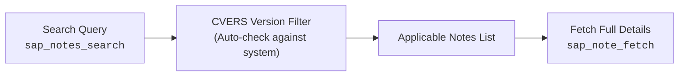

<!-- AUTO-GENERATED FILE - DO NOT EDIT MANUALLY. Source: agents-docs/skill-source/templates -->

# External Ecosystem, Notes & Support Portal Guide

This manual covers external knowledge integration across SAP Support Portal Notes, SAP Business Accelerator Hub, SAP Fiori Apps Reference Library, and S-User authentication.

---

## 📋 SAP Support Portal Notes & KBAs



### 1. Searching Notes (`sap_notes_search`)
Query me.sap.com for relevant SAP Notes, Knowledge Base Articles (KBAs), and bug fixes:
```json
sap_notes_search(
  query: "WDYA dump when activating CDS",
  system_alias: "TD1",
  include_irrelevant: false
)
```
- **Relevance Filtering**: By default, automatically checks the connected SAP system's installed component releases (from `CVERS`) and filters out notes already superseded by the active Support Package level.
- **Cross-Release Inspection**: Set `include_irrelevant: true` to bypass release filtering for research or cross-system planning.

### 2. Fetching Note Content (`sap_note_fetch`)
Retrieve the complete note text, symptoms, cause, manual resolution steps, prerequisite notes, and correcting Support Packages:
```json
sap_note_fetch(
  note_id: "3386534",
  system_alias: "TD1"
)
```

---

## 🔐 S-User Portal Authentication (`sap_portal_login`)

When querying protected SAP external endpoints (Fiori Apps Library, API Hub, or Support Notes), if the response returns `AUTH_REQUIRED`:
1. Invoke `sap_portal_login()` or instruct the user to open the Web Dashboard and click **S-User Login**.
2. An interactive browser window will launch for the user to safely authenticate with their SAP S-User credentials.
3. Once authenticated, subsequent portal requests automatically use the persistent secure session token.

---

## 🌐 SAP Business Accelerator Hub (`sap_api_hub_search` / `sap_api_hub_fetch`)

Search and retrieve pre-packaged SAP APIs, CDS views, events, and integration scenarios:
- **Search Catalog**:
  ```json
  sap_api_hub_search(
    query: "Sales Order A2X"
  )
  ```
- **Fetch Artifact Metadata**:
  ```json
  sap_api_hub_fetch(
    id: "API_SALES_ORDER_SRV",
    kind: "api"
  )
  ```
  *Supported Kinds*: `"package"`, `"api"`, `"event"`, `"cdsview"`.

---

## 📱 SAP Fiori Apps Reference Library (`sap_fiori_app_search` / `sap_fiori_app_fetch`)

Discover standard Fiori applications and extract exact technical configuration requirements:
- **Search Apps**:
  ```json
  sap_fiori_app_search(
    query: "Manage Purchase Orders"
  )
  ```
- **Fetch App Implementation Details**:
  ```json
  sap_fiori_app_fetch(
    fiori_id: "F0842A"
  )
  ```
  *Extracted Metadata*: Business Catalog IDs, Business Roles (`PFCG`), Target Mappings (Semantic Object / Action), OData Service names, and BSP Application containers.
