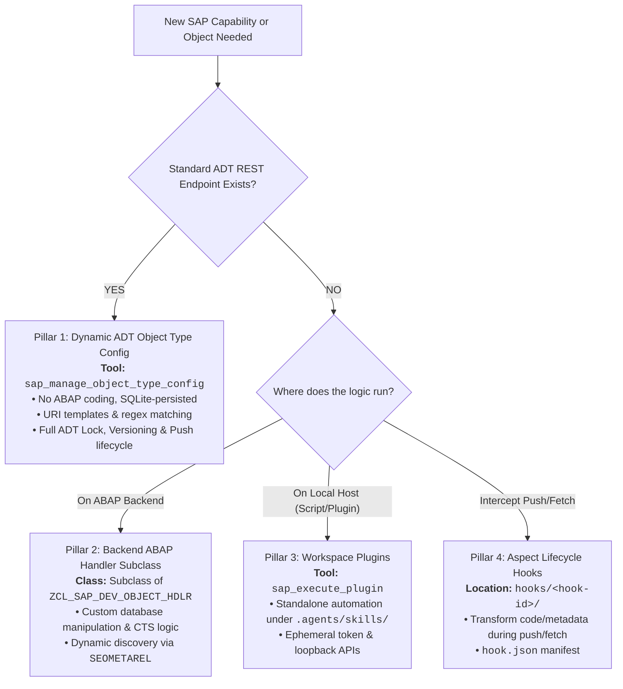

<!-- AUTO-GENERATED FILE - DO NOT EDIT MANUALLY. Source: agents-docs/skill-source/templates -->

# SAP-Bridge Extensibility & Customization Guide

`sap-bridge` provides four distinct extensibility mechanisms allowing autonomous AI agents and developers to support custom SAP object types, intercept push/fetch lifecycles, or execute custom automations without modifying Go daemon source code.

---

## 🎯 Extensibility Selection Matrix ("When to Choose What")



| Extensibility Pillar | Trigger / Tool | Primary Purpose | Implementation Location |
| :--- | :--- | :--- | :--- |
| **1. Dynamic ADT Object Types** | `sap_manage_object_type_config` | Add ADT endpoints for unmapped SAP object types | SQLite DB (`sap_custom_object_types`) |
| **2. ABAP Backend Handlers** | `ZCL_SAP_DEV_OBJECT_HDLR` | Custom backend push/fetch/metadata logic | ABAP class inheriting from `ZCL_SAP_DEV_OBJECT_HDLR` |
| **3. Workspace Plugins** | `sap_execute_plugin` | Run on-demand custom scripts with SAP access | `.agents/skills/<plugin-id>/` |
| **4. Aspect Lifecycle Hooks** | Implicit during `sap_fetch` / `sap_push` | Intercept, transform, or validate code/metadata | `hooks/<hook-id>/` |

---

## 1. Dynamic ADT Object Type Configuration (`sap_manage_object_type_config`)

When you need to work with an SAP object type that has an ADT REST endpoint but is not built into the bridge binary:

```json
sap_manage_object_type_config(
  action: "create",
  object_type: "SFIR",
  adt_type: "SFIR/S",
  extension: ".xml",
  use_full_xml: true,
  creation_parent: "/sap/bc/adt/sfir",
  creation_content_type: "application/vnd.sap.adt.sfir.v1+xml",
  adt_templates: [
    {
      "pattern": "^.*$",
      "template": "discovery:http://www.sap.com/adt/categories/sfir:/sap/bc/adt/sfir/$0"
    }
  ]
)
```
- `sap_fetch` and `sap_push` immediately use these templates for zero-code lifecycle operations without restarting the daemon.

---

## 2. Backend ABAP Handler Subclasses (`ZCL_SAP_DEV_OBJECT_HDLR`)

For object types without ADT REST endpoints requiring custom backend extraction or modification logic:

1. Create an ABAP class inheriting from `ZCL_SAP_DEV_OBJECT_HDLR`:
```abap
CLASS zcl_sap_dev_hdlr_custom DEFINITION
  PUBLIC
  INHERITING FROM zcl_sap_dev_object_hdlr
  FINAL
  CREATE PUBLIC.

  PUBLIC SECTION.
    METHODS:
      supports_type REDEFINITION,
      fetch_aspect  REDEFINITION,
      push_aspect   REDEFINITION.
ENDCLASS.
```
2. `ZCL_SAP_DEV_RPC` automatically detects all subclasses via `SEOMETAREL` at runtime—no proxy recompilation or SICF reconfiguration needed.

---

## 3. Workspace Plugins (`sap_execute_plugin`)

Plugins execute in isolated OS child processes to run specialized workflows (e.g. legacy RFC calls, custom data generators).

### Directory Structure & Manifest (`sap-dev-plugin.json`)
```text
your-workspace/
└── .agents/
    └── skills/
        └── sap-echo/
            ├── sap-dev-plugin.json  <-- Plugin manifest
            ├── SKILL.md             <-- Subagent prompt instructions
            ├── echo_call.js         <-- Execution script
            └── .sap-dev.sig         <-- Cryptographic signature (or Dev Mode)
```

**Manifest Schema (`sap-dev-plugin.json`)**:
```json
{
  "name": "sap-echo",
  "description": "Executes standard RFC STFC_CONNECTION test module.",
  "required_permissions": ["STFC_CONNECTION"]
}
```

### Execution via `sap_execute_plugin`:
```json
sap_execute_plugin(
  script_path: ".agents/skills/sap-echo/echo_call.js",
  payload: { "requtext": "Hello SAP" }
)
```

---

## 4. Aspect Lifecycle Hooks (`hook.json`)

Aspect Hooks are workspace-local scripts triggered implicitly when `sap-bridge` fetches or pushes SAP objects, allowing custom transformations (such as multi-language translations or metadata enrichment).

### Directory Structure & Manifest (`hook.json`)
```text
your-workspace/
└── hooks/
    └── custom-translations/
        ├── hook.json   <-- Interceptor rules
        └── hook.js     <-- Interceptor script
```

**Manifest Schema (`hook.json`)**:
```json
{
  "id": "custom-translations",
  "name": "Custom Translations Interceptor",
  "aspect": "translations",
  "object_types": ["PROG", "CLAS"],
  "handler": "./hook.js"
}
```

---

## 🔐 Guarded Loopback APIs & Environment

Both plugins and hooks receive ephemeral credentials injected by the daemon:
- `SAP_BRIDGE_URL`: Base URL of the bridge server (e.g., `http://127.0.0.1:58454`).
- `SAP_BRIDGE_TOKEN`: Short-lived Bearer token authorizing loopback requests.
- `SAP_SYSTEM_ID`: Active SAP system ID.
- `SAP_WORKSPACE_DIR`: Absolute path to active workspace.

### Available Loopback Endpoints:
- `POST /api/guarded/rpc`: Invokes any registered MCP tool.
- `POST /api/guarded/request`: Performs direct REST/ADT HTTP requests.
- `POST /api/guarded/sql`: Performs OpenSQL queries.
- `GET|POST /api/guarded/settings`: Decrypts/encrypts workspace vault settings.

---

## 🛠️ Extensibility SDK (`sap-dev-sdk.js`)

The skill packages a zero-dependency helper SDK in `references/`:
- **[`sap-dev-sdk.js`](./sap-dev-sdk.js)** / **[`sap-dev-sdk.d.ts`](./sap-dev-sdk.d.ts)**

```javascript
const sdk = require('./sap-dev-sdk');

async function run() {
    const input = await sdk.parseInput();
    try {
        const result = await sdk.callRpc('sap_execute_rfc', { requtext: input.text || "Hello" }, [
            { object_name: 'STFC_CONNECTION', object_type: 'FUNC', package: 'SRFC' }
        ]);
        sdk.success(result);
    } catch (err) {
        sdk.fail(`Failed: ${err.message}`);
    }
}
run();
```

- **Developer Mode**: Toggle on Developer Mode in the Web Dashboard **Extensibility** tab to temporarily bypass cryptographic signature checks during local development.
