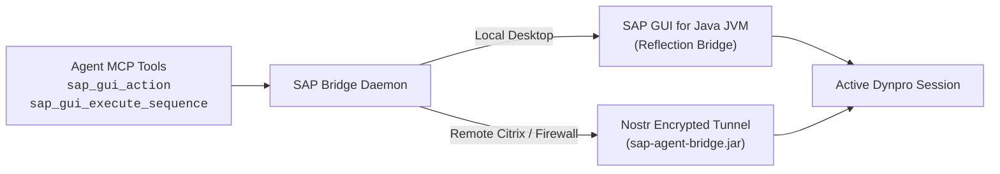

<!-- AUTO-GENERATED FILE - DO NOT EDIT MANUALLY. Source: agents-docs/skill-source/templates -->

# SAP GUI Automation & Smart Sequence Guide

This manual covers UI automation across SAP GUI for Java, EnjoySAP controls (Trees, ALV Grids, TableControls), modal dialogs, and parameterized macro sequences.

---

## 🛠️ Architecture & Execution Modes



### 1. Prerequisites
- **Local Workstations**: Requires SAP GUI for Java with an active session running on Java 17+. If offline, `sap_gui_status` returns diagnostics to start the GUI.
- **Remote Citrix / Nostr Tunnel**: When `auth_type: tunnel` is configured, GUI automation routes through an end-to-end encrypted Nostr relay. Launch `java -jar sap-agent-bridge.jar <token>` inside Citrix to connect.

---

## 🧭 Semantic `@`-Aliases & Control Discovery

Never hardcode 100-character DOM ID strings (e.g. `/app/con[0]/ses[0]/wnd[0]/usr/...`). Use high-level `@`-aliases:

| Smart Alias | Target Control | Description |
| :--- | :--- | :--- |
| **`@tree`** / **`@tree[0]`** | `GuiTree` / `GuiSimpleTree` | Main navigation, SPRO, or transaction tree hierarchy. |
| **`@grid`** / **`@alv`** | `GuiGridView` | Primary interactive ALV Grid. |
| **`@grid:COLNAME`** | `GuiGridView` | Specific ALV Grid containing column `COLNAME` (e.g. `@grid:HUIDENT`). |
| **`@table`** / **`@table[0]`** | `GuiTableControl` | Classic Dynpro TableControl with rows and columns. |
| **`@editor`** | `GuiTextedit` | Multiline ABAP / Text editor control. |
| **`@toolbar`** | `GuiToolbarControl` | Application toolbar with action buttons and dropdown menus. |

Inspect available controls on screen at any time:
```json
sap_gui_inspect(
  capture_screenshot: true
)
```

---

## 🎯 Typed Single-Step Actions (`sap_gui_action`)

### 1. Hierarchical Tree Navigation
Use `tree_path: [...]` to pass an array of node titles from root to target leaf, completely eliminating delimiter conflicts with SAP slashes:
```json
sap_gui_action(
  target_control: "@tree",
  tree_path: ["Documents", "Handling Unit"],
  tree_action: "double_click"
)
```
*Supported Tree Actions*: `"double_click"`, `"select"`, `"expand"`, `"collapse"`, `"click_link"`, `"press_button"`, `"change_checkbox"`.

### 2. ALV Grid Selection & Toolbar Methods
Select a row and dispatch a toolbar method or context menu item in one atomic roundtrip:
```json
sap_gui_action(
  target_control: "@grid",
  grid_row: 0,
  grid_button: "&MB_OTHER",
  grid_menu_item: "&METHOD_ZSHOW"
)
```

### 3. Semantic Buttons & Virtual Keys (`vkey`)
Use semantic button labels or standard Virtual Keys (`vkey`) instead of positional button IDs:
*   `press_button: "Execute"` or `press_button: "New Entries"` or `press_button: "Position..."`
*   `vkey: 0` (Enter), `vkey: 2` (Choose), `vkey: 3` (Back), `vkey: 5` (New Entries), `vkey: 8` (Execute), `vkey: 11` (Save), `vkey: 12` (Cancel), `vkey: 14` (Delete), `vkey: 15` (Exit).

### 4. Tabular Data Extraction (`sap_gui_read_table`)
Read and paginate table records directly into structured JSON:
```json
sap_gui_read_table(
  table_id: "@grid",
  max_rows: 50
)
```

---

## 🚨 Modal Dialog Escalation & Fresh Screen Context

1. **Automatic Modal Capture (`modal_dialog`)**:
   - If an action opens a popup (`wnd[1]`, confirmation dialog, transport prompt, or selection screen), the response embeds `modal_dialog: { modal_index, window_title, program, dynpro, buttons: [...], fields: {...} }`.
2. **Fresh Screen Context & Screenshots (`screen_context`, `screenshot_path`)**:
   - Every GUI tool automatically returns the post-action screen state (program, dynpro, message type, status bar text, and screenshot path).
3. **Safe Retreat Actions**:
   - Navigation actions (`VKey 3` Back, `VKey 12` Cancel, `VKey 15` Exit, and `/n`) are always permitted to safely return to initial screens.

---

## ⚡ Smart Macro Sequence Engine (`sap_gui_execute_sequence`)

For complex, multi-step business transactions, execute a declarative sequence with dynamic parameter hydration, assertions, and checkpoints:

```json
sap_gui_execute_sequence(
  sequence: {
    "name": "create_warehouse_order",
    "description": "Create manual WT in /SCWM/TODET",
    "steps": [
      { "action": "set_tcode", "tcode": "/n/SCWM/TODET" },
      { "action": "set_fields", "fields": { "P_LGNUM": "{lgnum}" } },
      { "action": "press_button", "button": "btn[8]" },
      { "action": "assert_screen", "program": "/SCWM/SAPLUI_TODET", "dynpro": "0100" }
    ]
  },
  params: {
    "lgnum": "EW01"
  }
)
```

Manage stored reusable sequences in SQLite via `sap_gui_manage_sequence(action: "save" | "read" | "list" | "delete")`.

---

## 🪲 Agent-Assisted SAP GUI Debugging

To debug dialog transactions, dynpros, or ABAP reports directly in SAP GUI (Windows or Java) while inspecting variables through MCP:

1. **User Setup**: Set target user in SE38 $\rightarrow$ *Utilities* $\rightarrow$ *Settings* $\rightarrow$ *ABAP Editor* $\rightarrow$ *Debugging* (User radio button = `<SY-UNAME>`).
2. **Synchronize Breakpoints in GUI**: Enter `/H_REFRESH_EXT_BPS` in the SAP GUI command field to load external breakpoints into session memory.
3. **Attach & Inspect**:
   - Use `sap_debug_breakpoint` to register the breakpoint.
   - Use `sap_debug_attach(trigger_program: "ZREPORT", timeout_seconds: 60)` for automated triggering, or `sap_debug_attach(timeout_seconds: 120)` when executing manually via GUI F8.
   - Step, inspect variables, and drill into internal tables via `sap_debug_step`, `sap_debug_context`, and `sap_debug_evaluate`.
   - Release session back to GUI with `sap_debug_step(action: "detachDebugger")` or conclude with `sap_debug_cleanup`.

---

## 🛑 Guard Policies & Prohibited Practices

- **Avoid Raw Scripting (`sap_gui_eval`)**: Use typed parameters in `sap_gui_action` and `sap_gui_read_table`.
- **Halt-in-Place on Unauthorized TCodes**: If an unapproved transaction is encountered, execution halts immediately without tearing down the call stack (`UNAUTHORIZED_TRANSACTION`) so the user can approve it in the Web UI while keeping dynpro state active.
