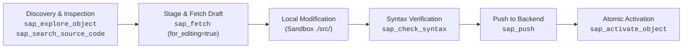
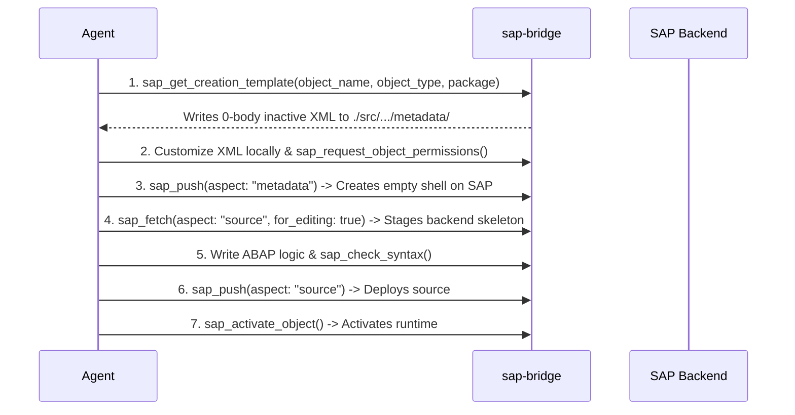

<!-- AUTO-GENERATED FILE - DO NOT EDIT MANUALLY. Source: agents-docs/skill-source/templates -->

# ABAP Repository Object Lifecycle & Source Push Guide

This manual details the standard development lifecycle for discovering, creating, editing, validating, and activating ABAP repository objects on the SAP backend.

---

## 🔄 The Complete ABAP Development Lifecycle



---

## 1. 🔍 Semantic Discovery & Search

### The Omni-Tool (`sap_explore_object`)
The primary entry point for object exploration with opinionated smart defaults:
- **Search Fallback**: Pass a wildcard or keyword (e.g. `object_name: "*SALES_ORDER*"`) to search across all TADIR objects.
- **Classes/Interfaces (`CLAS`, `INTF`)**: Returns method/attribute structures, method signatures, visibility, and inheritance hierarchy.
- **CDS Views (`DDLS`)**: Returns forward architectural dependency graphs of underlying SQL tables, joins, and associations.
- **BAdIs & Spots (`SXSD`, `ENSC`)**: Maps the full enhancement chain (Spot &rarr; Definition &rarr; Implementing Classes).
- **Packages (`DEVC`)**: Returns a recursive object tree. Filter with `object_types: ["CLAS"]` for large packages.
- **OData Services (`ODAT`)**: Maps `$metadata` EntitySets and discovers underlying DPC/MPC classes.

### Domain Crawling & Backend Code Search
- **`sap_explore_domain(target: "/SCWM/CORE", mode: "top_down" | "bottom_up")`**: Explores package and Application Component hierarchies.
- **`sap_explore_enhancements(object_name: "...", object_type: "PROG" | "CLAS" | "FUGR")`**: Scans ABAP source to discover all explicit enhancement points, sections, implicit routine/class hooks, and active implementations.
- **`sap_search_source_code(query: "...", package_name: "Z*", object_type: "CLAS")`**: Searches backend ABAP code using regex/string patterns.
- **`sap_where_used(object_name: "...", object_type: "...")`**: Traces backward dependencies and callers before refactoring.
- **`sap_resolve_frontend_target(query: "Define Plant", target_type: "spro")`**: Decodes TCODEs and SPRO nodes to backend programs/screens.
- **`sap_lookup_object_types`**: Queries the local cache for supported ADT object types and MIME configurations.

---

## 2. 📥 Fetching for Editing (`sap_fetch`)

Use `sap_fetch` with `for_editing: true` to stage an object locally:
```json
sap_fetch(
  workspace_dir: "<workspace_dir>",
  aspect: "source",
  object_name: "ZCL_MY_CLASS",
  object_type: "CLAS",
  for_editing: true
)
```
- **Staging Location**: Writes clean ABAP syntax (no line numbers) to `./src/<system_alias>/<object_name>.<type_extension>`.
- **Baseline ETag**: Records a baseline snapshot (version 0) with the backend ETag in SQLite.
- **Draft Protection**: If an unpushed local draft exists, `sap_fetch(for_editing=true)` automatically archives it as a `LOCAL_DRAFT` in SQLite before updating with fresh backend code.
- **Enhancement Auto-Detection**: If the object has active enhancement implementations (explicit points/sections or implicit boundary hooks), `sap_fetch(for_editing=true)` automatically detects them, auto-stages a spliced read-only reference to `./tmp/<system>/peek_<object>.abap` (`peek_file_path`), lists unique implementation names in `active_enhancements`, and alerts the agent in `result` while preserving 100% pristine base code in `./src/`.
- **Read-Only Peeking**: Calling `sap_fetch` with `for_editing: false` stages code to `./tmp/<system>/peek_<object>.abap` for transient inspection without polluting the `./src/` sandbox.

---

## 3. 📤 Pushing Changes (`sap_push`)

After modifying local files in `./src/`, push them back to SAP:
```json
sap_push(
  workspace_dir: "<workspace_dir>",
  aspect: "source",
  object_name: "ZCL_MY_CLASS",
  object_type: "CLAS",
  comment: "Refactored method to use inline declarations"
)
```

### Atomic Push Pipeline:
1. **Object Guard Authorization**: Validates that the object/package is whitelisted.
2. **Hash-Aware ETag Pre-flight**: Compares local baseline ETag against live backend. If ETag changed because metadata or text elements were updated, but source content remains identical to baseline, the bridge transparently updates the baseline ETag and proceeds. Legitimate concurrent modifications by other developers remain strictly blocked.
3. **LOCK & Auto-Unlock**: Acquires an ADT enqueue lock (`_action=LOCK&accessMode=MODIFY`), executes the PUT, and automatically unlocks upon success.
4. **Transport Check**: Reuses active CTS transport task locks or prompts the user via Object Guard.
5. **Version Capture**: Stores the pushed source + new ETag in SQLite as a `PUSH` event.

### Supported Push Aspects:
| Aspect | Description | Target Types |
| :--- | :--- | :--- |
| **`source`** | Main ABAP source code. | `CLAS`, `PROG`, `FUGR/FF`, `DDLS`, `BDEF` |
| **`definitions`** | Local class type definitions (`*.clas.locals_def.abap`). | `CLAS` |
| **`implementations`**| Local class method implementations (`*.clas.locals_imp.abap`). | `CLAS` |
| **`testclasses`** | ABAP Unit test classes (`*.clas.testclasses.abap`). | `CLAS`, `PROG` |
| **`macros`** | ABAP macro definitions (`*.clas.macros.abap`). | `CLAS` |
| **`metadata`** | Non-code structural XML properties (labels, settings). | `DTEL`, `DOMA`, `TABL`, `MSAG`, `SRVD` |
| **`translations`** | Multi-language text translations XML. | `CLAS`, `PROG`, `TABL`, `DTEL` |
| **`dynpro`** | Screen flow logic and layout JSON (`<prog>:<dynnr>`). | `PROG`, `FUGR` |
| **`textelements`** | Text symbols, selection texts, and list headers. | `CLAS`, `PROG`, `FUGR` |
| **`all`** | Scans workspace and pushes all modified artifacts in dependency order. | `CLAS`, `PROG`, `FUGR` |

---

## 4. 🛠️ Creating New Repository Objects

Follow this 7-step lifecycle to instantiate new objects cleanly on the backend:



### Function Modules (`FUNC` in `FUGR`)
- Pass parent Function Group in `parent_container`: `sap_get_creation_template(object_name: "Z_MY_FM", object_type: "FUNC", parent_container: "Z_MY_FUGR")`.
- Edit signatures using standard pseudo-ABAP comment blocks (`IMPORTING`, `EXPORTING`, `CHANGING`, `TABLES`, `RAISING`) pushed with `object_type: "FUGR/FF"`.

### Message Classes (`MSAG`) & Messages
- Whitelist the parent container (`MSAG`) via `sap_request_object_permissions(object_name: "ZRF_BASIS", object_type: "MSAG")`.
- To create or update an individual message without locking the entire class XML, use granular push: `sap_push(aspect: "message", msgid: "ZRF_BASIS", msno: "004", message_text: "...")`.

---

## 5. ⚡ Validation, Quick Fixes & Activation

1. **Syntax Check**: Execute `sap_check_syntax(source_file_path: "...")` before pushing.
2. **Syntax Quick Fix**: Call `sap_syntax_quick_fix(source_file_path: "...", finding_uri: "...")` to apply compiler-suggested fixes.
3. **Element Info (F2 Help)**: Call `sap_get_element_info(source_file_path: "...", find_token: "lv_var")` to retrieve type definitions and documentation.
4. **Inactive Objects Discovery**: Call `sap_fetch_inactive_objects` to list unactivated dependencies.
5. **Mass Activation**: Call `sap_activate_object(objects: [...])` to atomically activate interrelated artifacts.
6. **Post-Activation ETag Refresh**: Successful activation produces a new active ETag. If further modifications are planned, re-fetch via `sap_fetch(aspect: "source", for_editing: true)` before pushing again to avoid HTTP `412 Precondition Failed`.
