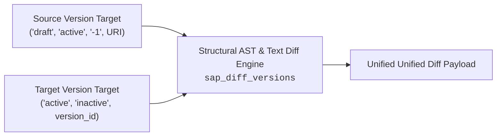

<!-- AUTO-GENERATED FILE - DO NOT EDIT MANUALLY. Source: agents-docs/skill-source/templates -->

# Versioning, Diffs & Revision History Guide

This manual covers structural diffing across local drafts, active/inactive backend states, offline SQLite snapshots, and remote SAP database revisions.

---

## 🔍 Structural Version Diffing (`sap_diff_versions`)



Compare any two revisions of an ABAP repository object:

```json
sap_diff_versions(
  object_name: "ZCL_MY_CLASS",
  object_type: "CLAS",
  from_version: "draft",
  to_version: "active",
  system_alias: "TD1"
)
```

### Supported Semantic Targets for `from_version` & `to_version`:
| Target Identifier | Description |
| :--- | :--- |
| **`"draft"`** | The local physical file currently staged in `./src/<system_id>/`. |
| **`"active"`** | The live active version currently stored on the SAP backend. |
| **`"inactive"`**| The live inactive version currently on the SAP backend (if one exists). |
| **`"-1"`** | The most recent historical snapshot recorded in the local SQLite database. |
| **`<integer>`** | A specific historical version number from SQLite (e.g. `12`). |
| **`<uri>`** | A direct ADT revision content URI (from `sap_list_remote_versions`). |

---

## 📜 Local SQLite Version Timeline (`sap_list_versions`)

Retrieve offline version history, ETags, timestamps, and commit events for objects in the current workspace:
```json
sap_list_versions(
  object_name: "ZCL_MY_CLASS",
  object_type: "CLAS",
  system_alias: "TD1"
)
```
- **Tracked Events**: `FETCH`, `PUSH`, `ACTIVATION`, `LOCAL_DRAFT`.
- Use the returned version IDs to target specific historical milestones in `sap_diff_versions`.

---

## 🌐 Remote SAP Backend Revision History (`sap_list_remote_versions` / `sap_fetch_remote_version`)

Query the permanent server-side revision log directly from the SAP back-end transport system (`E070`/`VRSD`):

### 1. List Server Revisions (`sap_list_remote_versions`)
```json
sap_list_remote_versions(
  object_name: "ZCL_MY_CLASS",
  object_type: "CLAS",
  system_alias: "TD1"
)
```
- Returns an array of revision entries with author, transport request number, date/time, and canonical `content_uri`.

### 2. Fetch Historical Code (`sap_fetch_remote_version`)
Stage a pristine copy of a remote historical version to `./tmp` for auditing without modifying the active `./src/` draft:
```json
sap_fetch_remote_version(
  content_uri: "/sap/bc/adt/programs/programs/ztest/versions/12345/source/main",
  system_alias: "TD1"
)
```
