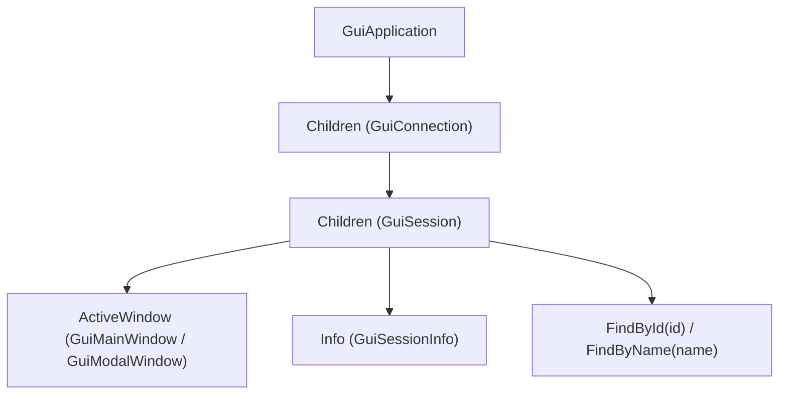

# SAP GUI Scripting API — Cheat Sheet & Common Idioms

## 🗺️ Core Object Model Hierarchy

## ⌨️ Virtual Key (VKey) Reference Table

Virtual Keys are kernel-level keyboard bindings that work identically across all SAP GUI themes, operating systems, and patch levels:

### 🌟 Most Common Operations
| VKey | Key | Typical SAP Action |
|:---:|:---|:---|
| **`0`** | `Enter` | Confirm / Refresh / Execute OK-Code / Continue |
| **`1`** | `F1` | Help / Technical Info |
| **`2`** | `F2` / `Double-Click` | Choose / Open Sub-Screen / Drill Down |
| **`3`** | `F3` | Back |
| **`4`** | `F4` | Value Help / Dropdown Search |
| **`5`** | `F5` | New Entries / Overview / Display $\leftrightarrow$ Change |
| **`6`** | `F6` | Maintain / Change Mode / Mark |
| **`7`** | `F7` | Previous / Header / Select Block |
| **`8`** | `F8` | Execute / Run Report |
| **`9`** | `F9` | Technical Information |
| **`11`** | `Ctrl+S` / `Shift+F11` | Save |
| **`12`** | `F12` | Cancel |
| **`14`** | `Shift+F2` | Delete Row / Entry |
| **`15`** | `Shift+F3` | Exit Transaction |
| **`42`** | `Shift+F6` | Translation / Text Element |
| **`71`** | `Ctrl+F` | Find |
| **`74`** | `Ctrl+N` | Create New GUI Window |
| **`76`** | `Ctrl+P` | Print |
| **`80`** | `Ctrl+PageUp` | First Page / Top of List |
| **`81`** | `Page Up` | Page Up / Previous Screenful |
| **`82`** | `Page Down` | Page Down / Next Screenful |
| **`83`** | `Ctrl+PageDown` | Last Page / Bottom of List |
| **`84`** | `Ctrl+G` | Find Next |

### 📋 Complete SAP GUI VKey Mapping (0–86)
| Range | VKeys | Key Combinations |
|:---|:---:|:---|
| **Base Function Keys** | `1` – `12` | `F1` to `F12` (`0` = `Enter`, `11` = `Ctrl+S` / `Shift+F11`, `12` = `F12`) |
| **Shift + Function Keys** | `13` – `24` | `Shift+F1` to `Shift+F12` (`14` = `Shift+F2` Delete, `15` = `Shift+F3` Exit) |
| **Ctrl + Function Keys** | `25` – `36` | `Ctrl+F1` to `Ctrl+F12` |
| **Ctrl + Shift + Function Keys** | `37` – `48` | `Ctrl+Shift+F1` to `Ctrl+Shift+F12` |
| **Ctrl + Alpha Keys** | `70` – `79` | `70`=Ctrl+E, `71`=Ctrl+F, `72`=Ctrl+G, `74`=Ctrl+N, `76`=Ctrl+P, `79`=Ctrl+Z |
| **Scrolling & Navigation** | `80` – `84` | `80`=First Page, `81`=Page Up, `82`=Page Down, `83`=Last Page, `84`=Find Next |

## 🗄️ Essential Control Types & Quick Snippets

### 1. `GuiTableControl` (Dynpro Tables) -> [`GuiTableControl.md`](classes/GuiTableControl.md)
* **Accessing Cells**: `tbl.getId() + "/txt<NAME>[col,row]"` (e.g. `tblSAPLBUS4TCTRL_TB035/txtTB035-CCLOCK[0,0]`)
* **Select Row**: `tbl.getAbsoluteRow(r).selected = true;`
* **Row Counts**: `tbl.getRowCount()`, `tbl.getVisibleRowCount()`
* **Position Row**: `tbl.setCurrentCellRow(r)`

### 2. `GuiGridView` (ALV Grid Controls) -> [`GuiGridView.md`](classes/GuiGridView.md)
* **Select Row**: `grid.selectedRows = "0";`
* **Click Cell**: `grid.click(row, colName);`
* **Double Click**: `grid.doubleClick(row, colName);`
* **Trigger Toolbar Button**: `grid.pressToolbarButton(fcode);`

### 3. `GuiTree` (Hierarchy Trees) -> [`GuiTree.md`](classes/GuiTree.md)
* **Select Node**: `tree.selectedNode = nodeKey;`
* **Double Click Node**: `tree.doubleClickNode(nodeKey);`
* **Expand Node**: `tree.expandNode(nodeKey);`

### 4. `GuiStatusbar` (System Messages) -> [`GuiStatusbar.md`](classes/GuiStatusbar.md)
* **Message Type**: `sbar.getMessageType()` (`"S"`=Success, `"W"`=Warning, `"E"`=Error, `"I"`=Info, `"A"`=Abort)
* **Text**: `sbar.getText()`

### 5. `GuiModalWindow` (Dialog Popups) -> [`GuiModalWindow.md`](classes/GuiModalWindow.md)
* **Modal Index**: `wnd[1]`, `wnd[2]`
* **Confirm Button**: `wnd1.findById("tbar[0]/btn[0]").press();`
* **Cancel**: `wnd1.sendVKey(12);`
